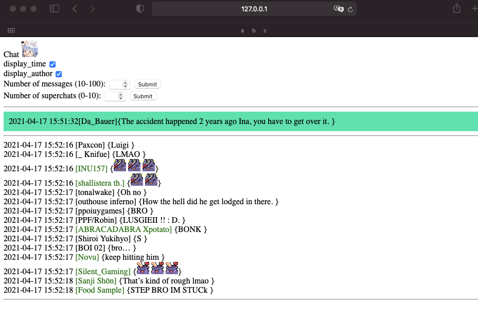

<!-- ABOUT THE PROJECT -->
## Youtube Chat Translator




This is a tool used to translate the chat of Youtube Livestreams. This tool uses a local flask server to continually fetch Youtube Chat metadata, and then takes the data and outputs it onto a webpage. 

Features:
* Translates chats and superchats into English
* Shows custom emotes from the channel
* Can choose how many messages and superchats to show at a time

### Built With

This project primarly uses a couple of libraries to fetch Youtube data instead of constantly scraping the webpage.
* [Flask](https://flask.palletsprojects.com/)
* [pytchat](https://pypi.org/project/pytchat/)
* [google_trans_new](https://pypi.org/project/google-trans-new/)

<!-- GETTING STARTED -->
## Getting Started

To run the server locally and start translating some chat messages, follow these simple example steps.

### Prerequisites

* Install flask
  ```sh
  $ pip install Flask
  ```

### View Chat

1. Download the files, and start the server using
  ```sh
  $ flask run
  ```
2. Open your browser and navigate to 127.0.0.1:5000/form
   
3. Insert a Youtube Stream link, e.g. https://www.youtube.com/watch?v=T5WDu_Vp6t0

4. Enjoy!
